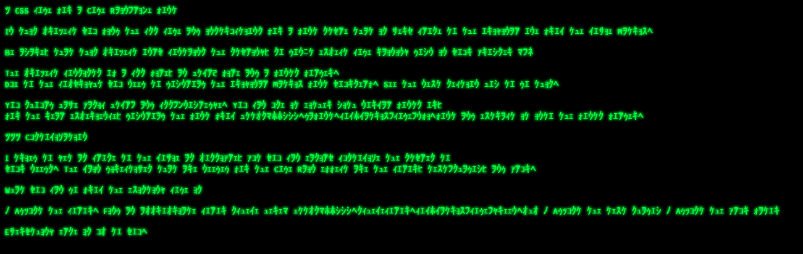

# CSS style Code Rain-like font

In this project you find the css code and instructions for a font style that is very close to the original one from the movie Matrix.

Be aware, that this project only contains the styling, so don't expect code raining down in your browser :-)

The project consists of a css file, an html5 file and a fonts folder. Due to the copyright you need to download the original Matrix font yourself. See the next section how to do this.

### Browser compatibility

It works in all modern browsers.

### Usage

You should have basic html- and css-knowledge. You can use it either with normal fonts or, for the real experience, download the font from https://www.dafont.com/matrix-code-nfi.font and extract it into the fonts folder.

To try it out, simply download the repository and open it in a browser.

### Customization

I tried to get as close to the movie as possible, but you can easily customize the styles to your needs. The main directives that are needed for the Code Rain effect are the color, text-shadow, and blur.

What you can do from the existing code is

* Adjust the color. Find an appropriate color scheme here: https://www.schemecolor.com/matrix-code-green.php
* Adjust the text shadow
* Adjust the blur fator

Everything else is up to you.

### License

This project is published under the GPL V3.

### Related 

* https://github.com/Rezmason/matrix
* https://rosettacode.org/wiki/Matrix_digital_rain
